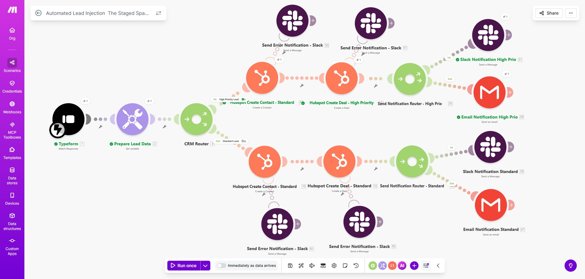

# 🚀 Automated Lead Injection — The Staged Space

***

## 📋 Project Overview

The **Automated Lead Injection** scenario is a Make.com automation workflow designed for **The Staged Space** that captures incoming leads from Typeform, classifies them by priority, and automatically injects them into HubSpot CRM — creating both a Contact and a Deal record. Based on lead priority, the system dispatches real-time notifications to the relevant team members via **Slack** and **Email**, ensuring no lead falls through the cracks.

***

## 🖼️ Workflow Overview



***

## ⚙️ Workflow Architecture

The scenario follows a **trigger → prepare → route → create → notify** pattern with dual execution paths based on lead priority.

### Trigger
| Module | App | Action | Module # |
|--------|-----|--------|----------|
| Typeform | Typeform | Watch Responses | 1 |

### Data Preparation
| Module | App | Action | Module # |
|--------|-----|--------|----------|
| Prepare Lead Data | Make.com Tools | Set Variable (lead scoring & normalization) | 2 |

### Routing
| Module | App | Action | Module # |
|--------|-----|--------|----------|
| CRM Router | Make.com Router | Splits into High Priority and Standard Lead paths | 4 |

***

## 🔀 Execution Paths

### 🔴 Path 1 — High Priority Lead

| Step | Module | App | Action | Module # |
|------|--------|-----|--------|----------|
| 1 | HubSpot Create Contact – Standard | HubSpot | Create a Contact | — |
| 2 | HubSpot Create Deal – High Priority | HubSpot | Create a Deal | — |
| 3 | Send Notification Router – High Prio | Router | Routes to Slack & Email | 30 |
| 4a | Slack Notification High Prio | Slack | Send a Message | 31 |
| 4b | Email Notification High Prio | Email | Send an Email | 38 |

**Error Handling:** Slack error alerts on contact failure (Module 50) and deal failure (Module 51).

### 🟢 Path 2 — Standard Lead

| Step | Module | App | Action | Module # |
|------|--------|-----|--------|----------|
| 1 | HubSpot Create Contact – Standard | HubSpot | Create a Contact | 10 |
| 2 | HubSpot Create Deal – Standard | HubSpot | Create a Deal | 12 |
| 3 | Send Notification Router – Standard | Router | Routes to Slack & Email | — |
| 4a | Slack Notification Standard | Slack | Send a Message | 39 |
| 4b | Email Notification Standard | Email | Send an Email | 37 |

**Error Handling:** Slack error alerts on contact failure (Module 61) and deal failure (Module 62).

***

## 🔄 Data Flow

```
Typeform Form Submission
        │
        ▼
Prepare Lead Data (Set Variable)
  └── Normalize fields, calculate lead score / priority flag
        │
        ▼
CRM Router
  ├── [High Priority Lead] ──► Create HubSpot Contact
  │                             └──► Create HubSpot Deal (High Priority)
  │                                   └──► Notify via Slack + Email (High Prio)
  │
  └── [Standard Lead] ──────► Create HubSpot Contact
                               └──► Create HubSpot Deal (Standard)
                                     └──► Notify via Slack + Email (Standard)
```

***

## 🛠️ Tools & Integrations

| Platform | Purpose |
|----------|---------|
| **Typeform** | Lead capture form — workflow trigger |
| **Make.com** | Automation orchestration platform |
| **HubSpot CRM** | Contact and Deal creation |
| **Slack** | Real-time team notifications per priority tier |
| **Email (Gmail/SMTP)** | Formal lead alert emails per priority tier |

***

## 💼 Business Value

- **Zero manual CRM entry** — lead data flows automatically from form to HubSpot
- **Priority-based triage** — high-value leads are instantly surfaced to the team
- **Faster response times** — real-time notifications reduce lead response latency
- **Error visibility** — dedicated Slack alerts on any failed CRM operations
- **Scalable architecture** — routing pattern can extend to additional priority tiers

***

## 🔧 Setup & Configuration

### Key Variables to Configure

| Variable | Description |
|----------|-------------|
| `Lead Priority Flag` | Logic in **Prepare Lead Data** that determines routing |
| `HubSpot Pipeline ID` | Target pipeline for deal creation |
| `HubSpot Deal Stage` | Initial deal stage for each priority path |
| `Slack Channel – High Prio` | Slack channel ID for high-priority alerts |
| `Slack Channel – Standard` | Slack channel ID for standard alerts |
| `Notification Email – High Prio` | Recipient for high-priority lead emails |
| `Notification Email – Standard` | Recipient for standard lead emails |

***
